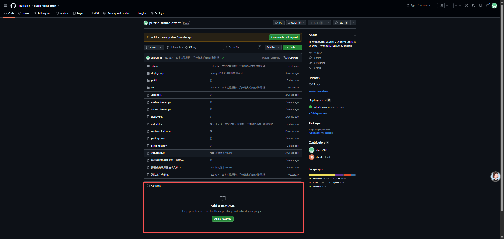

<div align="center">

# 🧩 拼图裁剪相框效果图

> **一款轻量级在线拼图DIY编辑工具** — 上传照片，自由拼图裁剪、叠加透明相框、添加艺术文字，一键下载高清效果图。纯浏览器端运行，无需安装任何软件。

[](https://shuren188.github.io/puzzle-frame-effect/)
[](https://github.com/shuren188/puzzle-frame-effect/releases)
[](LICENSE)


---



</div>

---

## 📖 项目介绍

### 这是一款什么样的工具？

**拼图裁剪相框效果图** 是一个面向普通用户的 **在线图片编辑工具**，专注于 **照片后期处理与DIY装饰** 场景。无论你是想制作拼图纪念品、给照片添加精美相框，还是在图片上添加艺术文字，这个工具都能帮你快速完成。

### 它能做什么？

| 场景 | 说明 |
|------|------|
| 🎁 **制作拼图礼物** | 上传情侣照、家庭合照，裁剪为拼图尺寸，送给亲友 |
| 🖼️ **照片装饰** | 为照片添加透明相框效果，模拟实木/艺术相框摆放效果 |
| ✏️ **添加文字水印** | 在图片上添加自定义文字，支持拖动、缩放、旋转、改色 |
| 📱 **社交媒体分享** | 制作精美的拼图效果图，分享到朋友圈、小红书、抖音 |
| 🛒 **电商展示** | 给商品图添加相框效果，展示拼图成品效果 |

### 核心优势

- **🔒 隐私安全** — 所有图片处理**仅在您的本地浏览器中完成**，不会上传到任何服务器，无需担心隐私泄露
- **⚡ 极致轻量** — 纯前端 Canvas 渲染，无后端依赖，无数据库，无需注册登录
- **📱 全端适配** — 手机、平板、PC 浏览器均可使用，界面自适应
- **💰 完全免费** — 开源 MIT 许可，无需付费，无功能限制
- **🌐 在线即用** — 打开网页就能编辑，无需下载安装任何软件

### 适用人群

- 普通用户（想给照片添加有趣效果）
- 摄影师（快速展示拼图成品效果）
- 电商卖家（制作商品展示图）
- 设计师（快速原型验证）
- 开发者（学习 Canvas 渲染技术）

---

## 🚀 安装与运行

### 环境要求

在开始之前，请确保你的开发环境满足以下要求：

| 环境 | 最低版本 | 说明 |
|------|---------|------|
| [Node.js](https://nodejs.org/) | >= 18 | JavaScript 运行时环境 |
| [npm](https://www.npmjs.com/) | >= 9 | Node.js 包管理器（安装 Node.js 时自动安装） |
| [Git](https://git-scm.com/) | 任意版本 | 版本控制工具，用于克隆仓库 |

> 💡 **验证已安装的版本：**
> ```bash
> node --version   # 如 v18.20.0
> npm --version    # 如 10.5.0
> git --version    # 如 2.45.0
> ```

### 第一步：克隆仓库

打开终端（Windows 使用 PowerShell 或 CMD，Mac/Linux 使用 Terminal），执行以下命令：

```bash
# 克隆项目到本地
git clone https://github.com/shuren188/puzzle-frame-effect.git

# 进入项目目录
cd puzzle-frame-effect
```

> 🔧 **如果遇到网络问题：** 可以在 GitHub 页面点击绿色的「Code」按钮 → 「Download ZIP」，下载后解压，然后进入解压后的目录。

### 第二步：安装依赖

```bash
npm install
```

执行后会看到类似以下输出：

```
added 127 packages in 3s
```

本项目所有依赖均为**开发依赖**（Vite 构建工具和 gh-pages 部署工具），**不包含任何生产依赖**，运行时完全依靠浏览器原生能力。

### 第三步：启动开发服务器

```bash
npm run dev
```

终端会显示：

```
  VITE v6.4.3  ready in 256 ms
  ➜  Local:   http://localhost:3000/
  ➜  Network: http://192.168.x.x:3000/
```

打开浏览器访问 **http://localhost:3000/** 即可看到应用界面。

> 💡 **热更新**：修改代码后浏览器会自动刷新，无需手动重启。

### 第四步：构建生产版本（可选）

当你完成开发或需要部署时，构建生产版本：

```bash
npm run build
```

构建产物会输出到 `dist/` 目录：

```
dist/index.html                7.49 kB │ gzip: 2.39 kB
dist/assets/index.css         23.08 kB │ gzip: 4.68 kB  
dist/assets/index.js          43.83 kB │ gzip: 12.74 kB
✓ built in 200ms
```

### 第五步：部署到 GitHub Pages（可选）

如果想把应用部署到线上，让所有人都能访问：

```bash
npm run deploy
```

> 部署脚本会自动读取最新的 Git 标签作为 commit 消息，例如 `v4.9.0: 更新内容描述`。  
> 需要先在 GitHub 仓库的 Settings → Pages 中将 Source 设置为 **gh-pages branch**。

### 常见安装问题

| 问题 | 解决方法 |
|------|---------|
| `npm install` 报错 EACCES | 使用管理员权限运行（Windows）或 `sudo npm install`（Mac/Linux）|
| `npm run dev` 端口被占用 | Vite 会自动尝试下一个端口，或修改 `vite.config.js` 中的 `server.port` |
| 克隆速度慢 | 使用 `git clone --depth 1` 只克隆最新版本 |
| 构建后图片不显示 | 确保 `public/` 目录下的资源路径正确 |

---

## 🎮 使用说明（完整版）

### 📸 第一步：上传图片

进入应用后，首先看到的是上传界面。有两种方式上传图片：

**方式一：点击上传**
1. 点击页面中央的上传区域
2. 从文件选择器中选择一张图片
3. 支持的格式：`JPEG` / `PNG` / `WebP` / `TIFF` / `BMP` / `GIF` / `SVG` / `AVIF`

**方式二：拖拽上传**
1. 从文件管理器或桌面直接拖拽一张图片到上传区域
2. 松开鼠标即可自动上传

> ⚠️ **注意：** 所有图片仅在浏览器本地处理，**不会上传到任何服务器**，可以放心使用隐私照片。

### 📐 第二步：选择拼图尺寸

上传图片后自动进入编辑器界面。底部工具栏默认选中「拼图尺寸」：

| 尺寸名称 | 物理尺寸 | 适合场景 |
|----------|---------|---------|
| **35片** | 10 × 15 cm | 小尺寸纪念品 |
| **70片** | 15 × 20 cm | 标准摆台照 |
| **120片** | 20 × 25 cm | 中等尺寸装饰画 |
| **200片** | 21 × 30 cm | 大尺寸海报风 |
| **300/520片** | 26 × 38 cm | 超大尺寸艺术画 |

**操作：** 点击对应的尺寸按钮，画布会自动调整比例。

### 🔧 第三步：调整图片

切换到「旋转角度」工具面板，或直接在画布上操作：

**直观操作（推荐）：**
| 操作 | 方式 | 说明 |
|------|------|------|
| **拖动位置** | 在画布上单指/鼠标拖拽 | 调整图片在拼图框内的裁剪位置 |
| **缩放图片** | 双指捏合（手机）/ 鼠标+滚轮 | 放大或缩小图片，范围 50%–300% |

**精确控制：**
- **缩放比例滑块**：拖动滑块精确调整 50%–300%
- **左转 90° / 右转 90°**：点击按钮旋转图片方向
- **重置**：点击顶栏「重置」按钮恢复初始状态

> 💡 **小技巧：** 先用「旋转」调整图片方向，再用「缩放」调整大小，最后「拖动」定位到合适位置。

### 🎨 第四步：设置填充颜色

切换到「填充颜色」工具面板：

1. 点击预设颜色按钮快速切换：
   - ⚪ 纯白（默认）
   - ⚫ 黑色
   - 🔵 科技蓝
   - 🟣 霓虹紫
   - 🩷 樱花粉
2. 点击 `+` 按钮打开 **HSV 颜色选择器**
   - 在色相条上选择主色调
   - 在 SV 面板上选择饱和度和明度
   - 手动输入 HEX 色值（如 `#FF5733`）
   - 点击「确定」应用颜色

### 🖼️ 第五步：相框预览（可选）

点击预览区右上角的 **「相框预览」开关**：

- 开启后，系统自动根据当前拼图尺寸和方向（横版/竖版）匹配对应的透明相框
- 相框覆盖在拼图之上，**文字也同时显示在相框之上**
- 关闭开关即可回到纯拼图预览
- 相框仅在预览时显示，**导出的图片不含相框**

> 💡 共有 10 组相框（5种尺寸 × 横版/竖版），每个相框都经过人工精确测量内框坐标，保证拼图完美嵌入。

### ✏️ 第六步：添加文字

切换到「添加文字」工具面板：

#### 创建文字

1. 点击底部工具栏的 **「添加文字」** 按钮
2. 画布中央出现一个 Meitu 风格文字框，**自动弹出输入弹窗**
3. 在输入框中输入文字内容
4. 可选择颜色（白/红/黄/粉 或点击 `+` 自定义）
5. 点击 **✓ 确认**（或点击 ✕ 取消）

#### 编辑已有文字

| 操作 | 方法 |
|------|------|
| **修改内容** | 点击画布上的文字主体 → 自动弹出输入弹窗 |
| **改颜色** | 在底部面板或输入弹窗中点击颜色按钮即时切换 |
| **移动位置** | 单指/鼠标直接拖拽文字框 |
| **缩放大小** | 双指捏合缩放 |
| **旋转角度** | 拖拽右下角 `↻` 角控件（同时缩放）|

#### 角控件操作

选中文字后，文字框四角有 4 个控制圆点：

```
  ┌─── ⋯ ──── ✕ ───┐
  │                  │
  │   文字内容区域    │
  │                  │
  └─── +1 ──── ↻ ───┘
```

| 位置 | 图标 | 功能 |
|------|------|------|
| **左上角** | `⋯` | 点击弹出图层菜单（上移一层 / 下移一层） |
| **右上角** | `✕` | 点击直接删除该文字 |
| **左下角** | `+1` | 点击复制一个相同文字（自动偏移位置） |
| **右下角** | `↻` | 按住拖拽：旋转角度 + 同步缩放 |

#### 图层管理

当有多个文字时，可以通过图层管理调整前后顺序：

- **方式一：** 点击文字左上角 `⋯` → 选择「上移一层」或「下移一层」
- **方式二：** 在底部文字面板点击 ↑ 或 ↓ 按钮

> 💡 图层顺序决定了文字的遮盖关系：上层文字会覆盖下层文字。

### 📥 第七步：下载图片

点击顶栏的 **「下载图片」** 按钮：

**PC 电脑端：**
- 自动下载一个 `.png` 格式的图片文件
- 文件名格式：`puzzle_35片_1700000000.png`

**手机端：**
- 弹出全屏遮罩，展示高清图片
- **长按图片** → 选择「保存到相册」
- 适合微信、浏览器、淘宝 App 等场景

**下载内容包含：**
- ✅ 拼图裁剪效果
- ✅ 所有添加的文字（位置/大小/颜色/旋转完全保留）
- ❌ 不包含相框（相框仅用于预览）

---

## 🏗️ 系统架构

### 设计理念

项目采用严格的 **分层模块架构**，遵循以下核心设计原则：

1. **图片处理与视图显示完全分离** — imageProcessor 只处理图片像素，frameProcessor 只负责显示，互不干扰
2. **文字作为独立图层** — 文字始终基于拼图尺寸渲染，确保相框/预览/下载三模式位置一致
3. **纯 Canvas 渲染** — 所有图形操作在 Canvas 上完成，不依赖 DOM 元素，性能高效

### 架构图

```
用户操作 (鼠标/触摸事件)
       │
       ▼
  ┌─────────────────────────────────────────────┐
  │  App (app.js)                               │
  │  状态管理 · 事件调度 · 手势识别 · 渲染编排  │
  └─────────────────────────────────────────────┘
       │
       ├─── imageProcessor.js ──── 图片处理核心
       │      renderImage() → PuzzleCanvas
       │      (加载/裁剪/缩放/旋转/填充)
       │
       ├─── frameProcessor.js ──── 相框显示（纯显示模块）
       │      renderFrame()
       │      (Bitmap Scale → 拼图 → 相框叠加)
       │
       ├─── textProcessor.js ───── 文字渲染模块
       │      renderTexts()
       │      (Meitu框体/角控件/命中检测)
       │
       ├─── safeAreaProcessor.js ── 相框安全区域（纯显示模块）
       │      renderSafeArea()
       │      (8mm物理尺寸→像素换算/虚线蒙版)
       │
       ├─── download.js ────────── 下载导出
       │      PC直接下载 / 移动端长按保存
       │
       └─── ColorPicker.js ────── HSV颜色选择器
              Photoshop风格 / SV面板+色相条
```

### 渲染流程

```
用户操作 (切换尺寸/旋转/拖动...)
       │
       ▼
scheduleRender()
       │
       ▼
requestAnimationFrame()
       │
       ├── rebuildPuzzle()
       │     └── renderImage() → PuzzleCanvas
       │
       └── refreshDisplay()
             ├── drawBaseOnly()    ← 无相框模式
             │     └── ctx.drawImage(PuzzleCanvas)
             │
             ├── renderFrame()     ← 有相框模式
             │     ├── drawImage(PuzzleCanvas → 内框)
             │     └── drawImage(透明PNG相框 → 最上层)
             │
             └── renderTexts()     ← 文字覆盖层
                   └── 基于拼图尺寸渲染文字
                        (包含控制框/角控件，下载时隐藏)
```

### 关键设计决策

| 决策 | 说明 |
|------|------|
| **文字坐标基准** | 文字位置基于拼图尺寸（而非屏幕尺寸），确保预览/相框/下载三模式位置完全一致 |
| **相框不参与下载** | 相框仅用于预览效果，下载图片不包含相框；文字属于编辑内容，下载时一并导出 |
| **增量式拖动** | 文字拖动使用增量式(delta)跟踪，缓存 wrapper 尺寸，避免频繁 getBoundingClientRect() 触发强制重排 |
| **分层渲染** | 拼图 Canvas 可复用，缩放/拖动等操作只需重绘相框和文字层，无需重新渲染拼图 |
| **零生产依赖** | 运行时完全依赖浏览器原生 Canvas API，没有任何第三方运行时库 |

---

## 📦 项目结构

```
puzzle-frame-effect/
│
├── index.html                       # ★ 单页HTML入口
│                                    包含上传界面、编辑界面、文字输入弹窗、图层菜单
│
├── vite.config.js                   # Vite 构建配置
│
├── package.json                     # 项目元信息与脚本
│   ├── scripts.dev    → vite        # 开发服务器
│   ├── scripts.build  → vite build  # 生产构建
│   └── scripts.deploy → node deploy-versioned.js  # 版本化部署
│
├── deploy-versioned.js              # 版本化部署脚本
│                                    自动读取 Git 标签作为 gh-pages commit 消息
│
├── public/                          # 静态资源目录
│   └── frames/                      # 透明相框资源 (WebP格式)
│       ├── h/                       # 横版相框 (35 / 70 / 120 / 200 / 300)
│       │   ├── 35.webp
│       │   ├── 70.webp
│       │   ├── 120.webp
│       │   ├── 200.webp
│       │   └── 300.webp
│       └── v/                       # 竖版相框 (35 / 70 / 120 / 200 / 300)
│           ├── 35.webp
│           ├── 70.webp
│           ├── 120.webp
│           ├── 200.webp
│           └── 300.webp
│
├── src/                             # ★ 源码目录
│   ├── main.js                      # 应用入口（DOM就绪后创建 App 实例）
│   ├── constants.js                 # 全局常量配置
│   │   ├── SIZES        → 5种拼图尺寸
│   │   ├── QUALITIES    → 原图/2倍高清
│   │   ├── PRESET_COLORS→ 5种预设填充色
│   │   ├── DEFAULTS     → 默认设置
│   │   └── ZOOM_RANGE   → 缩放范围 50-300%
│   │
│   ├── components/
│   │   ├── app.js                   # ★ 核心主应用类 (~1034行)
│   │   │   ├── 状态管理             → image/texts/frame/gesture state
│   │   │   ├── DOM缓存              → 所有 UI 元素的引用
│   │   │   ├── 事件绑定              → 上传/拖拽/触摸/按钮
│   │   │   ├── 5个工具面板           → size/quality/adjust/color/text
│   │   │   ├── 手势处理              → 单指拖拽/双指缩放/角控件
│   │   │   ├── 分层渲染              → rebuildPuzzle → refreshDisplay
│   │   │   ├── 文字系统              → 创建/编辑/颜色/图层/复制/删除
│   │   │   └── 下载导出              → 高清PNG/移动端长按保存
│   │   │
│   │   └── ColorPicker.js           # HSV 颜色选择器组件 (~334行)
│   │       ├── SV面板               → 饱和度+明度
│   │       ├── 色相条               → 360°色相选择
│   │       ├── HEX输入              → 手动输入色值
│   │       └── 触摸/鼠标拖拽         → 跨端兼容
│   │
│   ├── utils/
│   │   ├── imageProcessor.js        # 图片处理核心 (~118行)
│   │   │   ├── loadImage()          → File → HTMLImageElement
│   │   │   └── renderImage()        → 填充背景 + 适配比例 + 缩放 + 旋转
│   │   │
│   │   ├── frameProcessor.js        # 相框显示模块 (~194行)
│   │   │   ├── FRAME_CONFIG         → 10组内框坐标（人工测量）
│   │   │   ├── loadFrameImage()     → 异步加载+缓存
│   │   │   ├── preloadAllFrames()   → 后台预加载所有相框
│   │   │   └── renderFrame()        → Bitmap Scale → 绘拼图 → 绘相框
│   │   │
│   │   ├── textProcessor.js         # 文字渲染模块 (~300行)
│   │   ├── safeAreaProcessor.js      # 相框安全区域 (8mm换算+虚线蒙版)
│   │   │   ├── createDefaultText()  → 默认文字对象
│   │   │   ├── renderTexts()        → Meitu框体+角控件绘制
│   │   │   ├── hitTestText()        → 精确命中检测（含旋转）
│   │   │   ├── getCornerScreenPos() → 角控件屏幕坐标
│   │   │   └── measureText()        → 文字尺寸测量
│   │   │
│   │   └── download.js              # 下载导出模块 (~50行)
│   │       ├── isWeChat/isAliApp    → 平台检测
│   │       ├── isMobile()           → 移动端检测
│   │       ├── showLongPressOverlay → 展示图片+长按保存
│   │       ├── downloadImage()      → PC直接下载/移动端长按
│   │       └── getOutputFilename()  → 智能文件名生成
│   │
│   └── styles/
│       └── main.css                 # 全局样式 (~280行)
│           ├── CSS变量              → 液态玻璃设计系统
│           ├── 上传界面              → 渐变背景+扫光动画
│           ├── 编辑界面              → 顶栏/预览区/工具栏
│           ├── 相框开关              → 右上角滑动开关
│           ├── 文字面板+输入弹窗      → Meitu风格
│           ├── ColorPicker           → 颜色选择器样式
│           ├── 图层菜单              → 弹出菜单
│           ├── Toast/Loading         → 提示组件
│           └── 响应式                → 手机/平板/PC适配
│
├── README.md                        # 项目说明文档（本文档）
├── 添加文字功能优化.txt              # 文字功能设计规范
├── analyze_frames.py                # 相框内框分析脚本
├── convert_frames.py                # 相框格式转换脚本
├── setup_fonts.py                   # 字体设置脚本
├── deploy.bat                       # Windows部署批处理（旧）
└── .gitignore                       # Git忽略规则

```

---

## 🛠️ 技术栈

| 类别 | 技术 | 说明 |
|------|------|------|
| **编程语言** | JavaScript (ES Module) | 原生 JavaScript，无 TypeScript |
| **构建工具** | [Vite 6](https://vitejs.dev/) | 极速开发服务器，秒级热更新 |
| **图形渲染** | [Canvas 2D API](https://developer.mozilla.org/zh-CN/docs/Web/API/Canvas_API) | 浏览器原生 2D 图形接口 |
| **样式系统** | 原生 CSS3 | 液态玻璃设计系统（backdrop-filter: blur） |
| **字体** | 系统默认字体 | PingFang SC / Microsoft YaHei / sans-serif |
| **部署** | [GitHub Pages](https://pages.github.com/) | 通过 gh-pages 包自动部署 |
| **生产依赖** | **零依赖** | 运行时不依赖任何第三方库 |

---

## 🔧 常见问题

### Q: 为什么手机端下载图片时要长按保存？

因为 iOS Safari 浏览器不支持 `<a download>` 属性，无法通过代码触发直接下载。所以我们采用兼容性最好的方案：展示图片 → 用户长按图片 → 选择「保存到相册」。这是所有移动端浏览器都支持的方式。

### Q: 为什么下载的图片不含相框？

相框是用于预览效果的道具，不属于图片编辑内容。下载时只导出**拼图 + 文字**，保证用户获得干净的拼图效果图。

### Q: 为什么我的图片上传后变形了？

应用会自动保持图片原始比例，不会变形。如果感觉变形，请检查：
1. 图片本身比例是否与所选拼图尺寸差异过大
2. 尝试使用「缩放比例」滑块调整图片大小

### Q: 最多可以添加多少个文字？

没有数量限制。每个文字都是独立对象，支持独立的拖动、缩放、旋转、颜色、图层管理。

### Q: 如何重置所有操作？

点击顶栏的「重置」按钮恢复图片缩放/旋转到默认状态。点击「重新上传」按钮回到上传界面，所有编辑内容（包括文字）将被清除。

### Q: 支持哪些图片格式？

JPEG、PNG、WebP、TIFF、BMP、GIF、SVG、AVIF。

---

## 🤝 参与贡献

欢迎任何形式的贡献！无论是提交 Bug 反馈、功能建议，还是直接提交代码。

### 贡献流程

```bash
# 1. Fork 本仓库
# 2. 克隆你的 Fork
git clone https://github.com/你的用户名/puzzle-frame-effect.git

# 3. 创建特性分支
git checkout -b feature/你的功能名称

# 4. 修改代码

# 5. 提交
git add -A
git commit -m "feat: 添加XX功能"

# 6. 推送
git push origin feature/你的功能名称

# 7. 在 GitHub 上创建 Pull Request
```

### 版本发布流程（维护者）

```bash
# 1. 修改代码并提交
git add -A && git commit -m "@ feat: vX.Y.Z - 描述"

# 2. ★ 更新 README.md 的「版本发布记录」章节，追加新版本条目

# 3. 打标签
git tag vX.Y.Z

# 4. 推送代码和标签
git push origin v4.0 && git push origin vX.Y.Z

# 5. 构建并部署（自动生成版本号 commit）
npm run build && npm run deploy
```

---

## 📋 版本发布记录

> 每次版本更新都会在此记录。版本号格式：`v主版本.次版本.修订号`

### v4.16.0 — 移除 renderFrame 中 Fit 逻辑，PuzzleCanvas 直接填满内框
> 2026-07-11

- **核心修改** `renderFrame()` 删除 `pcAspect / innerAspect` 判断和 `drawW/drawH/drawX/drawY` 计算
- **修改** PuzzleCanvas 不再重新缩放适配内框比例，而是 `drawImage` 直接填满 `(innerLeft, innerTop, innerWidth, innerHeight)`
- **同步** `refreshDisplay()` 中文字层和安全区域定位同样删除重复的 aspect 计算
- **原则** Frame Preview 不参与任何图片计算 — 不 Aspect、不 Fit、不 Cover、不 Center
- **原则** Frame Preview 是 Editor 的镜像（Mirror），不是重新渲染
- **零影响** 所有已有编辑功能不变

### v4.15.0 — 统一渲染架构：ClipPath 替代裁剪画布 + 导出含相框
> 2026-07-11

- **核心重构** 移除 `croppedPc` 中间画布方案 — 安全区域不再作为"裁剪后的图片"，而是作为 ClipPath（裁剪路径）/ 视觉蒙版存在
- **相框预览** `renderFrame()` 使用原始 `pc`（与编辑区完全相同的 PuzzleCanvas），安全区域以黑色半透明蒙版覆盖虚线外部分，不参与任何缩放计算
- **文字层** `ctx.clip()` 裁剪至安全区域后绘制，与编辑区安全区域逐像素一致
- **导出** 相框模式下输出带相框 + 安全区域裁剪的成品图（`_framed.png`），无相框模式保持原有逻辑
- **根本原则** 编辑区安全区域 = 相框预览 = 最终导出，三者 100% 逐像素一致
- **零影响** 所有已有编辑功能不变

### v4.14.0 — 相框预览只显示安全区域内图片（最终成品一致性）
> 2026-07-11

- **核心修复** 相框预览不再直接使用完整 PuzzleCanvas，而是先裁剪至安全区域（去掉四周 8mm），再传入 renderFrame()
- **根因** renderFrame() 将整张 `puzzleCanvas` 绘入内框，导致虚线外本应被相框遮挡的内容仍可见
- **修复** 创建 `croppedPc` 中间画布（仅安全区域 cropW×cropH），文字层同样裁剪后再传入
- **原则** 相框预览 = 最终成品预览，与用户收到的实物完全一致；编辑区域仍显示完整图片
- **不变** 下载图片为完整拼图+文字，不含相框/安全区域标记

### v4.13.0 — 智能适配改为开关 + 相框裁剪至安全区域
> 2026-07-11

- **变更** 智能适配从按钮改为左上角开关（与右上角「相框预览」开关对称），去除星形图标
- **变更** 相框预览时图片和文字均裁剪至 8mm 安全区域内，虚线外内容被裁剪——模拟真实相框物
理遮挡效果
- **变更** 关闭智能适配开关自动恢复默认缩放状态
- **不变** 编辑图片（无相框）时仍显示安全区域虚线提醒
- **不变** 下载图片为完整拼图+文字，不含相框/安全区域标记

### v4.12.0 — 交互优化：适配按钮位置+安全区域反转+默认白边
> 2026-07-11

- **变更** 上传后不再自动触发智能适配，保持默认100%缩放（白边填充），需点击「✨智能适配」按钮手动触发
- **变更** 「✨智能适配」按钮移至预览区左上角，与右上角「相框预览」开关对称
- **变更** 「添加相框」→「相框预览」
- **变更** 安全区域逻辑反转：编辑图片（无相框）时显示虚线+灰蒙版提醒8mm遮挡范围，开启相框预览时隐藏虚线（相框自身已遮盖）
- **不变** 安全区域和提示文字仅作编辑参考，不进入下载

### v4.11.0 — 新增智能适配 + 相框安全区域
> 2026-07-11

- **新增【一键智能适配】**：上传图片后自动执行 object-fit:cover 算法，图片完整覆盖拼图区域不留白边
- **新增** 调整面板「✨智能适配」按钮，编辑过程中随时恢复到最佳适配状态
- **新增【相框安全显示区域】**：相框开启时显示 8mm 安全边界辅助层（半透明灰蒙版 + 青色虚线）
- **新增** 安全区域提示文字：引导用户将重要内容放置在虚线以内
- **新增** `safeAreaProcessor.js` — 纯显示模块，不影响下载导出
- **不变** 所有已有功能零影响

### v4.10.0 — 详尽版项目介绍/安装步骤/使用说明
> 2026-07-11

- **重写** README.md 完整覆盖四大板块：项目介绍、安装步骤、使用说明、系统架构
- **新增【项目介绍】**：工具定位、适用场景（6种场景）、核心优势（5项）、适用人群
- **新增【安装步骤】**：环境要求检查 → 克隆 → 安装 → 开发 → 构建 → 部署，含每个命令的输出示例和常见问题解答
- **新增【使用说明】**：7 步完整图文指南，含操作对照表、实用技巧提示
- **新增【系统架构】**：架构图、渲染流程、关键设计决策（5项）、完整项目结构树（每个文件标注功能说明）
- **新增【常见问题FAQ】**：解答 7 个高频问题
- **新增【开源许可】**：MIT 许可声明

### v4.9.0 — GitHub 首页 README 优化
> 2026-07-11

- **新增** README 顶部嵌入应用截图预览
- **新增** 功能总览四栏概览表格
- **新增** 折叠式使用指南（details/summary）
- **新增** 版本发布记录表格化呈现
- **新增** 版本更新流程图解
- **优化** GitHub 仓库描述和主页链接

### v4.8.0 — 全面重写 README + 版本化部署
> 2026-07-11

- **新增** `deploy-versioned.js` — 部署时自动读取最新 Git 标签生成版本化 commit 消息
- **重写** README — 完整的 GitHub 首页项目说明，含架构图、功能总览、折叠式使用指南

### v4.7.0 — 手机端下载修复
> 2026-07-11

- **修复** 手机端（iOS Safari / Android Chrome）点击下载按钮无反应
- **改进** 所有移动端统一使用「展示图片 → 长按保存到相册」流程
- **改进** 引入版本化部署脚本

### v4.6.0 — 文字坐标系重构 + 拖动流畅性
> 2026-07-11

- **核心修复** 文字始终基于拼图尺寸独立渲染，相框/预览/下载三模式位置完全一致
- **修复** ColorPicker HEX输入框过长把确定按钮挤出弹窗
- **修复** 拖动中途卡顿：缓存 wrapper 尺寸、移动端 preventDefault、去除冗余钳位

### v4.5.0 — 面板布局优化 + 增量式拖动
> 2026-07-11

- 角控件三点改为横向 `⋯`
- 颜色按钮和操作按钮合并为同一行居中显示
- 预设颜色精简为白/红/黄/粉四色
- 拖动改为增量式(delta)跟踪，手指离开画布边界不影响操作

### v4.4.0 — 美图秀秀风格文字系统（重大重构）
> 2026-07-11

- **Meitu 文字框**：虚线内框 + 实线外框 + 4 个角控制圆点
- **角控件交互**：`⋯` 图层 / `✕` 删除 / `+1` 复制 / `↻` 旋转缩放
- **文字输入弹窗**：背景虚化 + 预览 + 输入框 + ✕/✓ + 颜色按钮
- **图层管理**：上移/下移一层，支持 N 个文字独立编辑
- **修复** ColorPicker 自定义颜色拾取缺失 CSS 样式

### v4.3.0 — ColorPicker 修复 + 提示优化
> 2026-07-11

- 修复自定义颜色选择器「+」按钮无法弹出（缺失 CSS 样式）
- 删除面板固定信息行，改为输入框聚焦时显示半透明操作提示

### v4.2.0 — 手势隔离加强 + 精确命中检测
> 2026-07-11

- 使用 Canvas `measureText()` 精确计算文字尺寸进行命中检测
- 双指缩放文字时同步选中状态
- 文字与图片手势隔离稳定性优化

### v4.1.0 — 点击画布文字编辑 + 选中边框
> 2026-07-11

- 点击画布上的文字自动选中并切换到文字编辑面板
- 选中文字显示青色虚线边框
- 拖动与点击精确分离（点击候选等待判定）
- 点击空白区域取消选中

### v4.0.0 — 文字功能精简重构
> 2026-07-11

- **移除** 思源黑体字体文件（节省 ~3MB 加载量）
- **移除** 旋转滑块和字体选择功能
- **改用** 系统默认字体（PingFang SC / Microsoft YaHei / sans-serif）
- **颜色即时更新**：点击颜色按钮立即生效
- **编辑仅更新内容**：位置、大小、颜色保持不变

### v3.x — 初期文字功能迭代
> 此前版本

| 版本 | 核心变更 |
|------|---------|
| v3.4 | 手势分离 + 独立对象管理 |
| v3.3 | 极简重构 |
| v3.2 | 颜色选择 + 精确缩放 |
| v3.1 | 文字功能修复 |
| v3.0 | 添加文字功能 + 三款自定义字体 |

### v2.x — UI/UX 迭代

| 版本 | 核心变更 |
|------|---------|
| v2.6 | WebP 相框压缩 97% + 分层渲染 <500ms |
| v2.5 | 字体调整 + 相框开关优化 |
| v2.4 | 上传页重新设计 |
| v2.3 | 赛博朋克 → 液态玻璃风格改版 |
| v2.2 | 液态玻璃风格 |
| v2.1 | 赛博朋克风格 |
| v2.0 | 全屏沉浸式布局 |

### v1.0 — 相框预览功能（初始版本）

- 基础拼图裁剪功能
- 透明 PNG 相框叠加
- 横版/竖版多尺寸支持

---

## 📄 开源许可

本项目基于 **MIT 许可** 开源，您可以自由使用、修改和分发。

[MIT](LICENSE) © shuren188

---

<div align="center">

**🧩 用 ❤ 制作的拼图DIY工具 — 自由拼图、自由编辑、高清放大**

[](https://shuren188.github.io/puzzle-frame-effect/)

</div>
